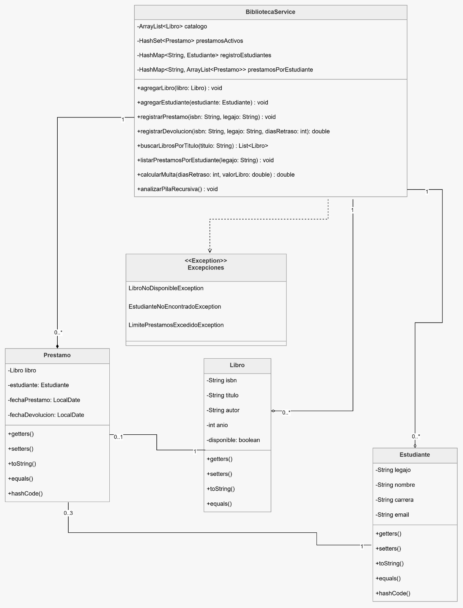

====================TP1: Gestión de Biblioteca - Programación III====================

Este proyecto implementa un sistema de gestión bibliotecaria desarrollado para la cátedra de Programación III de la UNLaR. El objetivo es demostrar el uso de colecciones, excepciones personalizadas, recursividad y arquitectura de capas en Java.

====================Tecnologías Utilizadas====================
Lenguaje: Java 21

Gestor de Dependencias: Maven

IDE: Visual Studio Code

==================== Estructura del Proyecto====================

biblioteca/
├── model/
│   ├── Libro.java
│   ├── Estudiante.java
│   └── Prestamo.java
├── exception/
│   ├── LibroNoDisponibleException.java
│   ├── EstudianteNoEncontradoException.java
│   └── LimitePrestamosExcedidoException.java
├── service/
│   └── BibliotecaService.java
├── ui/
│   └── ConsolaUI.java
└── Main.java

El código se organiza siguiendo el estándar de Maven en los siguientes paquetes:

unlar.edu.ar.model: Clases de entidad (Libro, Estudiante, Prestamo).

unlar.edu.ar.service: Lógica de negocio y gestión de colecciones.

unlar.edu.ar.exception: Manejo de errores mediante excepciones personalizadas.

unlar.edu.ar.ui: Interfaz de usuario por consola.

==================== Funcionalidades Principales====================

Gestión de Préstamos: Validaciones de disponibilidad y límite de préstamos (máx. 3 por estudiante).

Cálculo de Multas: Implementación de recursividad para calcular el 1% de multa por día de retraso (tope 30 días).

Colecciones: Uso de ArrayList para el catálogo, HashMap para estudiantes y HashSet para préstamos activos.

Búsquedas: Búsqueda parcial de libros por título (Case-Insensitive).

====================Cómo ejecutar el proyecto====================
Para compilar y ejecutar el sistema desde la terminal, situarse en la carpeta raíz del proyecto y ejecutar:

Bash
mvn exec:java -Dexec.mainClass="unlar.edu.ar.Main"
📊 Diagrama de Clases
El diseño del sistema se basó en el siguiente diagrama UML:
