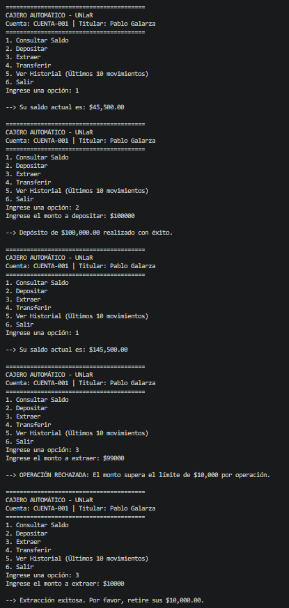
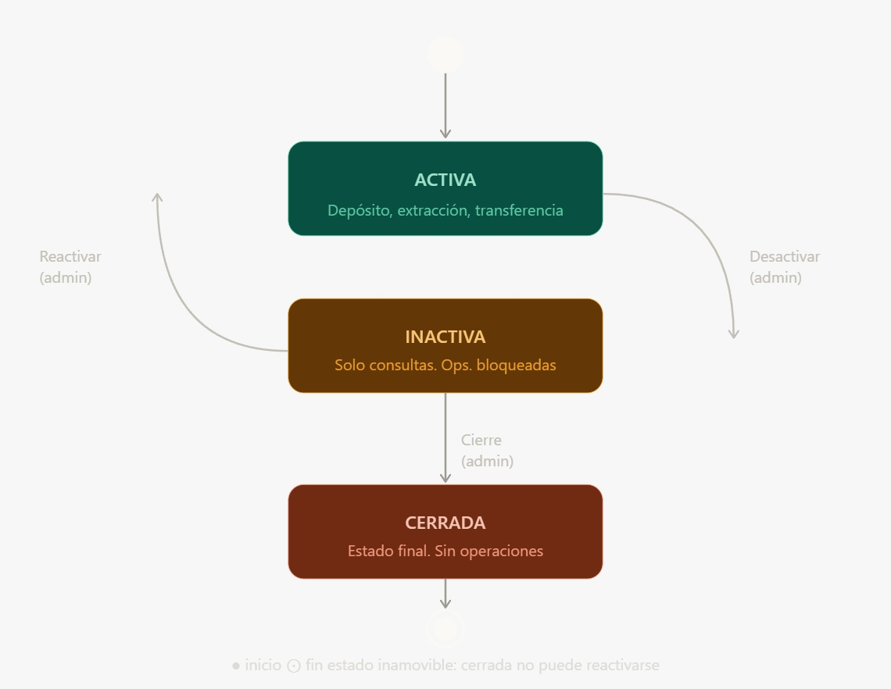

# 🏧 Simulador de Cajero Automático (ATM)

[cite_start]**Institución:** Universidad Nacional de La Rioja (UNLaR) - DACEFyN [cite: 58]
[cite_start]**Asignatura:** Programación III [cite: 58]
[cite_start]**Trabajo Práctico:** Nº 1.2 - Unidad 1 [cite: 58]

##  Integrantes del Equipo
* **Pablo Galarza**
* **Chaile Marisa**

---

##  Descripción del Proyecto
Este repositorio contiene el código fuente de un simulador de Cajero Automático (ATM) desarrollado en Java. [cite_start]El objetivo educativo principal de este proyecto es introducir y aplicar conceptos de Programación Orientada a Objetos (POO) avanzada, tales como el manejo del estado, la inmutabilidad, el encapsulamiento estricto y el manejo de errores en sistemas transaccionales[cite: 59].

## Funcionalidades Principales
[cite_start]El sistema cumple con los siguientes requisitos funcionales[cite: 60]:

* [cite_start]**Gestión de Cuentas:** Soporte para múltiples cuentas bancarias con control de estado (activas/inactivas) e inmutabilidad estricta en el número de cuenta[cite: 61, 65].
* **Operaciones Bancarias:**
  * [cite_start]**Depósitos:** Validación de montos positivos y actualización de saldo[cite: 62].
  * [cite_start]**Extracciones:** Control de saldo disponible y validación de límite de extracción ($10,000 por operación)[cite: 62].
  * [cite_start]**Transferencias:** Operaciones atómicas entre cuentas registradas en el sistema[cite: 62].
  * [cite_start]**Consultas de Saldo:** Operaciones de lectura que no modifican el estado de la cuenta[cite: 62].
* [cite_start]**Historial y Auditoría:** Registro detallado de cada operación utilizando `StringBuilder`[cite: 65]. [cite_start]Cada registro incluye *timestamp*, tipo de transacción, monto y saldo resultante[cite: 63]. [cite_start]Se limita la visualización a los últimos 10 movimientos[cite: 63].
* [cite_start]**Interfaz de Usuario:** Menú interactivo por consola implementado con *switch expressions* y validación robusta de entradas numéricas (`InputMismatchException`) para evitar cierres inesperados[cite: 63].

## Manejo de Excepciones
[cite_start]El sistema implementa una jerarquía de excepciones personalizadas para controlar la lógica de negocio[cite: 62]:
* `SaldoInsuficienteException`
* `LimiteExtraccionExcedidoException`
* `CuentaInactivaException`

## Arquitectura y Estructura de Paquetes
[cite_start]El proyecto respeta una arquitectura estricta dividida en capas funcionales[cite: 65]:
* `unlar.edu.ar.model`: Entidades del dominio (`CuentaBancaria`, `Transaccion`, `TipoTransaccion`).
* `unlar.edu.ar.exception`: Excepciones de negocio.
* `unlar.edu.ar.service`: Lógica principal y reglas de negocio (`CajeroService`).
* `unlar.edu.ar.ui`: Interfaz gráfica de consola (`MenuCajeroUI`).
* `unlar.edu.ar.util`: Herramientas de formateo de moneda y fechas.

##  Cómo ejecutar el proyecto
1. Clona este repositorio en tu máquina local.
2. Abre el proyecto en tu IDE de preferencia (Visual Studio Code, IntelliJ IDEA, Eclipse).
3. Compila y ejecuta la clase principal `Main.java`.
4. [cite_start]El sistema iniciará automáticamente una **simulación con 3 cuentas y 15 transacciones** variadas (incluyendo el manejo de excepciones) para demostrar la funcionalidad completa[cite: 66, 68]. 
5. Al finalizar la simulación, se abrirá el menú interactivo para operar el cajero de forma manual.

