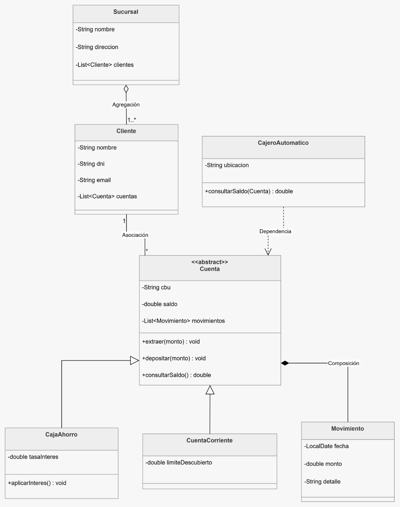

# 🎵 Streaming Music API - TP Algoritmos Fundamentales

## 📋 Descripción del Trabajo Práctico


- ✅ Gestionar canciones, artistas, álbumes y productoras
- ✅ Crear playlists automáticas con duración exacta
- ✅ Generar recomendaciones personalizadas
- ✅ Aplicar programación funcional (Streams API) y concurrente

## 👥 Integrantes

| Integrante 
|------------|
| Marisa Chaile  - |
| Galarza Pablo
| | - |

## 🛠️ Tecnologías

- **Java 21** (Virtual Threads, Records)
- **Spring Boot 3.5.x**
- **Swagger/OpenAPI** (Documentación)
- **Maven** (Dependencias)

---

## 🚀 Ejecución Rápida

```bash
# Compilar
mvn clean compile

# Ejecutar
mvn spring-boot:run

Diagrama de Clases
